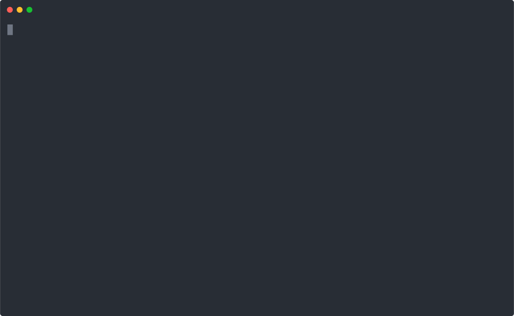

<div style="float: right;">
	<a href="https://github.com/glhd/conveyor-belt/actions" target="_blank">
		
	</a>
	<a href="https://codeclimate.com/github/glhd/conveyor-belt/test_coverage" target="_blank">
		
	</a>
	<a href="https://packagist.org/packages/glhd/conveyor-belt" target="_blank">
        
	</a>
	<a href="./LICENSE" target="_blank">
        
    </a>
    <a href="https://twitter.com/inxilpro" target="_blank">
        
    </a>
</div>

# Conveyor Belt

Conveyor Belt provides all the underlying mechanics necessary to write artisan commands that process lots of data efficiently.

## Quickly process 1000's of records


## Get verbose output when necessary


## Step through execution & log operations if needed


## See what data is changed by your commands


## And so much more


## Installation

```shell
# composer require glhd/conveyor-belt
```

## Usage

To use Conveyor Belt, use one of two traits in your Laravel command:

- `\Glhd\ConveyorBelt\IteratesIdQuery` — use this if your underlying query can be ordered by `id` (improves performance)
- `\Glhd\ConveyorBelt\IteratesQuery` — use this if your query **is not ordered by `id`**

### Basic Example

```php
class ProcessUnverifiedUsersCommand extends Command
{
  use \Glhd\ConveyorBelt\IteratesIdQuery;
  
  // First, set up the query for the data that your command will operate on.
  // In this example, we're querying for all users that haven't verified their emails.
  public function query()
  {
    return User::query()
      ->whereNull('email_verified_at')
      ->orderBy('id');
  }
  
  // Then, set up a handler for each row. Our example command is either going to
  // remind users to verify their email (if they signed up recently), or queue
  // a job to prune them from the database.
  public function handleRow(User $user)
  {
    // The `progressMessage()` method updates the progress bar in normal mode,
    // or prints the message in verbose/step mode
    $this->progressMessage("{$user->name} <{$user->email}>");
    
    $days = $user->created_at->diffInDays(now());
    
    // The `progressSubMessage()` method adds additional context. If you're in
    // normal mode, this gets appended to the `progressMessage()`. In verbose or
    // step mode, this gets added as a list item below your `progressMessage()`
    $this->progressSubMessage('Registered '.$days.' '.Str::plural('day', $days).' ago…');
    
    // Sometimes our command trigger exceptions. Conveyor Belt makes it easy
    // to handle them and not have to lose all our progress
    ThirdParty::checkSomethingThatMayFail();
    
    if (1 === $days) {
      $this->progressSubmessage('Sending reminder');
      Mail::send(new EmailVerificationReminderMail($user));
    }
    
    if ($days >= 7) {
      $this->progressSubmessage('Queuing to be pruned');
      PruneUnverifiedUserJob::dispatch($user);
    }
  }
  
  // By setting collectExceptions() to true, we tell Conveyor Belt to catch
  // and log exceptions for display at the end of the operation
  public function collectExceptions(): bool
  {
    return true;
  }
}
```
